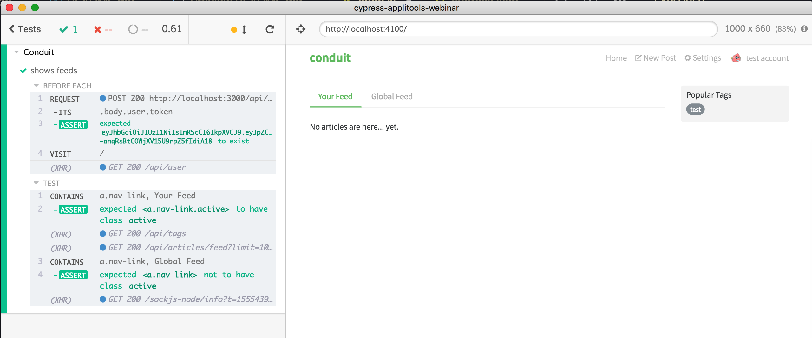

# cypress-applitools-webinar

Companion Code to "Functional and Visual Testing with Cypress.io and Applitools" webinar

## Functional tests

Tests are in the folder [cypress/integration](cypress/integration)

- [login-spec.js](cypress/integration/login-spec.js) shows successful and unsuccessful login via user interface
- [feeds-spec.js](cypress/integration/feeds-spec.js) shows how to login using XHR request bypassing the login form UI
- [new-post-spec.js](cypress/integration/new-post-spec.js) adds a new post
  - before each test, all existing posts are deleted using `cy.task('deleteAllArticles')` command. This task is defined in [cypress/plugins/index.js](cypress/plugins/index.js) file.
  - before each test, we log the user in via custom command `cy.login()` defined in [cypress/support/index.js](cypress/support/index.js) file
  - we also import the post content using `import` directives, the post itself is in file [cypress/fixtures/post.js](cypress/fixtures/post.js)

The test writing and organization are covered in slides at [https://slides.com/bahmutov/flawless-tests](https://slides.com/bahmutov/flawless-tests)

## Test setup

- installed [Cypress](https://www.cypress.io) with `npm i -D cypress`
- scaffolded Cypress folder with `npx @bahmutov/cly init`
- set the base url in [cypress.json](cypress.json) file

```json
{
  "baseUrl": "http://localhost:4100"
}
```

- manually made a test user account: `tester@test.com` `password1234` and set the user profile picture to `https://robohash.org/6FJ.png?set=set3&size=150x150`


- looked at the login action. The user logs in via XHR call to `POST http://localhost:3000/api/users/login` which returns JWT and sets it in local storage under `jwt` key. The payload to login is `{user: {email: "tester@test.com", password: "password1234"}}`. Implemented the same functionality using [cy.request](https://on.cypress.io/request) by grabbing the user account object from `cypress.json` environment object

```js
describe('Conduit', () => {
  beforeEach(() => {
    cy.request('POST', 'http://localhost:3000/api/users/login', {
      user: Cypress.env('user'),
    })
      .its('body.user.token')
      .should('exist')
      .then((token) => {
        localStorage.setItem('jwt', token)
      })

    cy.visit('/')
  })

  it('shows feeds', () => {
    cy.contains('a.nav-link', 'Your Feed').should('have.class', 'active')
    cy.contains('a.nav-link', 'Global Feed').should('not.have.class', 'active')
  })
})
```

And we are in business!



**Tip:** find different ways to quickly login in [Logging in](https://github.com/cypress-io/cypress-example-recipes#logging-in-recipes) recipes.
