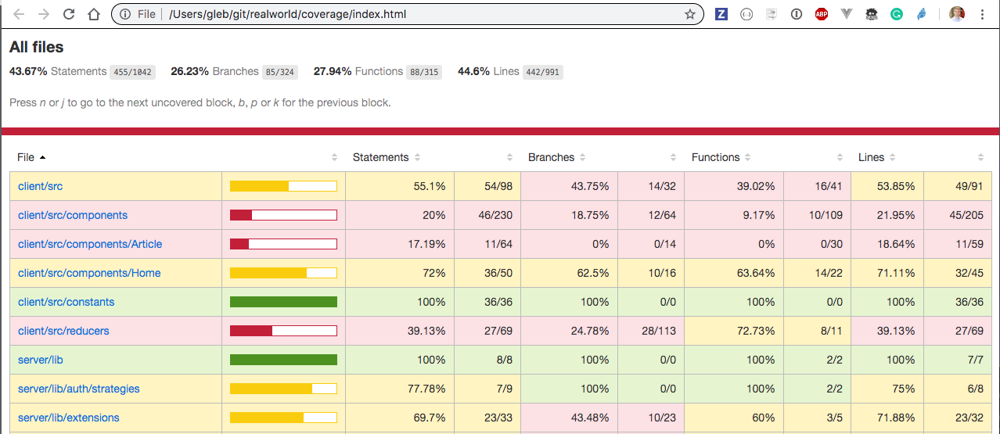

> 🚩 Looking for another real-world demonstration of Cypress in action? Check out the [Cypress Real World App repository](https://github.com/cypress-io/cypress-realworld-app).

# Conduit App [![renovate-app badge][renovate-badge]][renovate-app]   

Fork of [applitools/cypress-applitools-webinar](https://github.com/applitools/cypress-applitools-webinar) which is a fork of [gothinkster/realworld](https://github.com/gothinkster/realworld) "Conduit" blogging application.

## Tests

The tests are in [cypress/integration](cypress/integration) folder

- [feeds-spec.js](cypress/integration/feeds-spec.js) shows how to check the favorite articles feed and the global feed
- [follow-user-spec.js](cypress/integration/follow-user-spec.js) shows how to create two users and check if one user can follow the other
- [login-spec.js](cypress/integration/login-spec.js) checks if the user can log in via UI and via API
- [new-post-spec.js](cypress/integration/new-post-spec.js) verifies that a new article can be published and updated
- [profile-spec.js](cypress/integration/profile-spec.js) lets the user edit their profile
- [register-spec.js](cypress/integration/register-spec.js) tests if a new user can register
- [tags-spec.js](cypress/integration/tags-spec.js) checks if tags work
- [pagination-spec.js](cypress/integration/pagination-spec.js) creates many articles via API calls and then checks if they are displayed across two pages
- [force-logout-spec.js](cypress/integration/force-logout-spec.js) verifies that unauthorized API calls force the user session to finish

## Full code coverage

Front- and back-end coverage for this application is collected using the [@cypress/code-coverage](https://github.com/cypress-io/code-coverage) plugin. You can run the locally instrumented server and client using `npm run dev:coverage` command. The backend coverage is exposed in [server/server/index.js](server/server/index.js) via endpoint listed in [cypress.json](cypress.json) (usually `GET /__coverage`). The frontend coverage is collected by instrumenting the web application source code on the fly, see the [client/.babelrc](client/.babelrc) file.

The combined report is saved in `coverage/index.html` after the tests finish:

The coverage is sent to [Coveralls.io](https://coveralls.io/repos/github/cypress-io/cypress-example-realworld) using command `npm run coveralls` from CircleCI AFTER partial coverage information from parallel E2E test runs is combined, see [circle.yml](circle.yml) file.

### Combining code coverage from parallel runs

If you do not use an external code coverage service for combining code coverage reports, you need to combine those reports yourself like this repository is showing in [circle.yml](circle.yml) file. Several E2E `cypress/run` jobs run in parallel, each job saving its own coverage report folder. Then every job copies the report (using `save-partial-coverage-report` command) into a unique folder to avoid overwriting via reports from other machines. When all E2E jobs are finished, and reports are copied together, then the CI calls a command to merge the reports (see the `merge-coverage-reports` command that uses `nyc merge` tool).

To learn more, read the [Cypress code coverage guide](https://on.cypress.io/code-coverage).

[renovate-badge]: https://img.shields.io/badge/renovate-app-blue.svg
[renovate-app]: https://renovateapp.com/

Requires Python 2.7 for node-gyp to be compiled.
